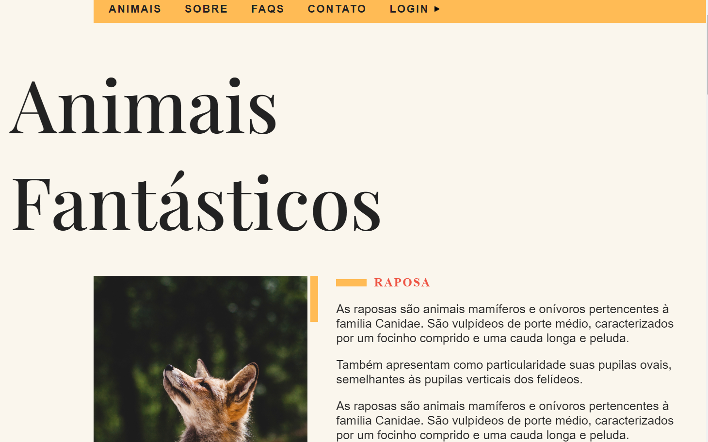
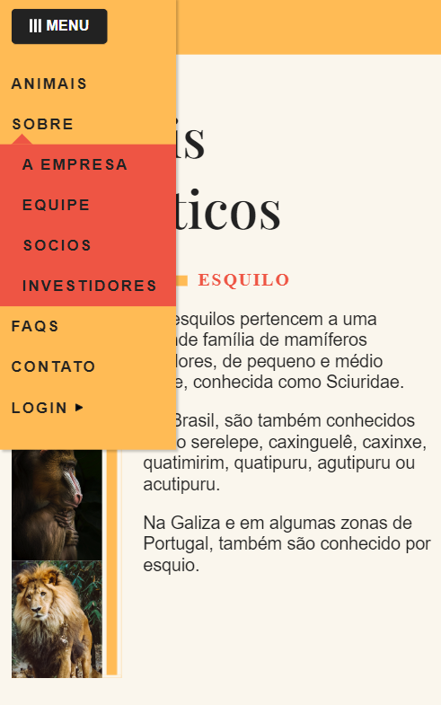

<h1 align="center"> Animais Fantásticos </h1>

  

 

 <a href="#-sobre-o-projeto">Sobre</a> •
 <a href="#-funcionalidades">Funcionalidades</a> •
  <a href="#-tecnologias">Tecnologias</a> •
 <a href="#-layout">Layout</a> • 
 <a href="#-autor">Autor</a> 

## 💻 Sobre o projeto

Foi uma página desenvolvida no curso de JavaScript da Origamid que usa JavaScript puro e possui informações de 6 animais.

---

## ⚙️ Funcionalidades

- [x] Animação de entrada:
  - [x] Ao acessar o site, os elementos visuais são animados de forma suave e atraente, proporcionando uma experiência visual agradável.
- [x] API do Bitcoin:
  - [x] O site apresenta o valor atual do Bitcoin em relação a 1000 reais, obtendo esses dados através de uma API.

---

## 🚀 Tecnologias

Esse projeto foi desenvolvido com as seguintes tecnologias:

- HTML e CSS
- JavaScript
- Git e Github

---

## 🎨 Layout

### Mobile

  

### Desktop

  

---

## 🦸 Autor

 
  
 <b>Amanda Lucia</b>
 
  

  

---

Feito com ❤️ por Amanda Lucia 👋🏽 [Entre em contato!](https://www.linkedin.com/in/amanda-lucia-ribeiro-pereira-434892229/)